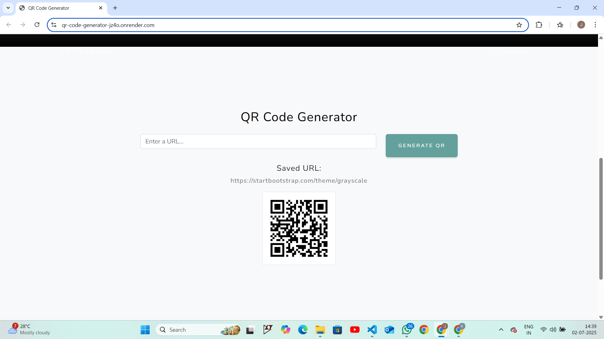

# QR Code Generator 🧾🔳

This is a full-stack **QR Code Generator** web app built using **Node.js** and **Bootstrap (Grayscale theme)**.  
It allows users to input a URL, generate a QR code, and display it along with the saved URL.

---

## 🚀 Features

- Accepts any URL input  
- Generates a QR Code (`.png` image)  
- Saves the URL in a text file  
- Displays the QR and the saved URL on the web page  
- Uses Express.js backend and Bootstrap 5 frontend  

---

## 📁 Project Structure

<pre><code>``` qr-code-generator/ 
  ├── index.js # Node.js server logic (Express, QR generation) 
  ├── package.json # NPM project config (dependencies, scripts) 
  ├── package-lock.json # Exact versions of installed dependencies 
  ├── .gitignore # Files to exclude from Git  
  ├── public/ # All static frontend files served to users 
  │ ├── index.html # Frontend UI with Bootstrap Grayscale theme 
  │ ├── css/ 
  │ │ └── styles.css # Custom or Grayscale Bootstrap CSS 
  │ ├── assets/ 
  │ │ └──  demo-preview.png #screenshots of page
  │ ├── qr_img.png # Auto-generated QR image (ignored in Git) 
  │ └── URL.txt # Auto-saved URL (ignored in Git) ``` </code></pre>


## 🚀 Deployed on Render  
👉 [](https://qr-code-generator-jz4o.onrender.com)

---

## 🔗 Live Demo  
👉 [View the QR Generator Live](https://qr-code-generator-jz4o.onrender.com)

---

## 📸 Screenshot  


## 🛠️ Setup & Run

bash
git clone https://github.com/krithikareddy22/Qr_code_generator-.git
cd qr-code-generator
npm install
node index.js
